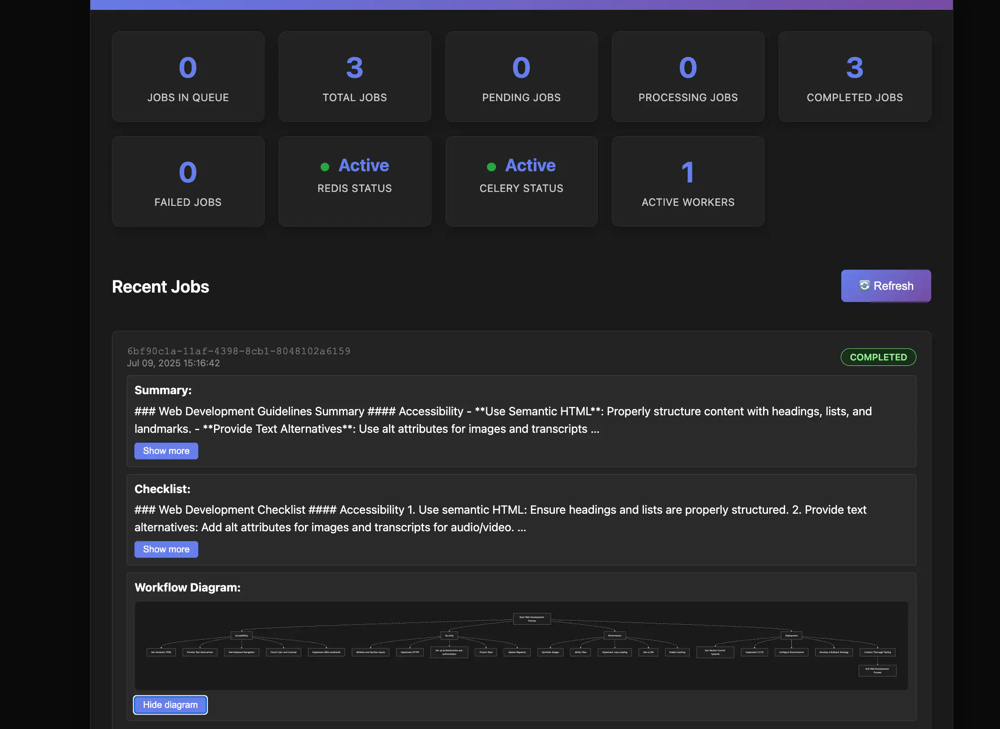

# Python Backend API with GPT Integration

A minimal Python backend API for job processing with GPT integration, built with Django, PostgreSQL, Celery and Redis.



## Features

- **Job Creation**: POST `/api/jobs` returns job ID `event_id` in <200ms
- **Asynchronous Job Processing**: Celery workers process jobs concurrently
- **Two-Step GPT Chain**: Summarize → Generate checklist workflow
- **Real-time Status**: GET `/api/jobs/{event_id}` returns current status and results
- **Swagger Docs OpenAPI**: Interactive API documentation
- **Comprehensive Testing**: Unit tests with proper mocking
- **Status Dashboard**: Visual overview of job queue, worker, and backend status

## Tools

- **API**: Django 4.2 + Django REST Framework
- **Task Queue**: Celery + Redis
- **Database**: PostgreSQL
- **AI Integration**: OpenAI gpt-4o
- **Docs**: drf-spectacular (OpenAPI)
- **Containerization**: Docker + Docker Compose

## Quick Start

1. **Clone the repository**:

   ```bash
   git clone https://github.com/gitrabbit3/python-job-api.git
   cd python-job-api
   ```

2. **Copy and configure environment variables**:

   ```bash
   cp env.example .env
   ```

   > Edit .env to set your **OPENAI_API_KEY** key and any other secrets

3. **Build and start the api with Docker Compose**:

   ```bash
   docker compose up --build
   ```

4. **Run tests**:

   ```bash
   docker-compose exec web python manage.py test jobs.tests
   ```

5. **Access the api**:
   - **API Base**: [http://localhost:8000/api/](http://localhost:8000/api/)
   - **API Documentation (Swagger UI)**: [http://localhost:8000/api/docs/](http://localhost:8000/api/docs/)
   - **Status Dashboard**: [http://localhost:8000/api/queue](http://localhost:8000/api/queue)

## Development

### Running Tests

```bash
docker compose exec web python manage.py test
```

### Running Tests with Coverage

Test Coverage Summary `(81%)`

| Module | Coverage | Status |
|--------|----------|--------|
| **Models** (`jobs/models.py`) | ~95% | ✅ Well Tested |
| **Serializers** (`jobs/serializers.py`) | ~90% | ✅ Well Tested |
| **Tasks** (`jobs/tasks.py`) | ~85% | ✅ Well Tested |
| **API Views** (`jobs/views.py`) | ~80% | ✅ Well Tested |
| **Overall Project** | ~75% | ✅ Good Coverage |


To Run Coverage:

```bash

docker compose exec web coverage run --source=. manage.py test

docker compose exec web coverage report

docker compose exec web coverage html   # Generates htmlcov/index.html

docker compose exec web coverage xml    # Generates coverage.xml

# Or use the helper script:
docker compose exec web python run_coverage.py
```

Coverage reports will be generated in:

- **Terminal**: Shows percentage coverage by module
- **HTML**: `htmlcov/index.html` (inside the container)
- **XML**: `coverage.xml` (inside the container)

To view the HTML report on your host, copy it out:

```bash
docker compose cp web:/app/htmlcov ./htmlcov
```

### Database Migrations

```bash
docker compose exec web python manage.py makemigrations
docker compose exec web python manage.py migrate
```

### Celery Worker Monitoring

```bash
docker compose logs worker
```

## API Endpoints

### Create Job

```bash
POST /api/jobs/
# Returns: {"event_id": "uuid"}
```

### Get Job Status

```bash
GET /api/jobs/{event_id}/
# Returns: {"event_id": "uuid", "status": "pending|processing|completed|failed", "result": { "summary": "...", "checklist": "...", "diagram": "..."}}
```

## Architecture Design

### High-Level Flow

1. **Job Creation**: API receives request → creates Job record → returns event_id immediately
2. **Async Processing**: Celery worker picks up job → executes two-step GPT chain
3. **Result Storage**: Summary and checklist stored in database
4. **Status Retrieval**: API returns current status and results

### Key Design Decisions & Tool Choices

- **Frameworks Choice**: Beyond requirements, the choice for Django REST Framework was to have the option of opting for robust or lean API development and rapid prototyping as Python generally lets you do this.
  - Celery for distributed asynchronous task processing;
  - Redis as the Celery message broker for speed and reliability.
- **Containerization**: Used Docker and Docker Compose to ensure consistent, reproducible environments and easy local/production deployment.
- **API Documentation / Frontend Visualization**: OpenAI spec is simple and straight forward to implement, so this was pretty much a go to. Also included is a status dashboard to monitor the jobs. I used Mermaid.js for dynamic workflow diagram rendering in the dashboard.

**Performance Choice**:

- POST `/api/jobs`: we immediately create jobs and return job event id to reduce the processing time and keep response time below 200ms.
- While in the background we run asynchronous job processing which prevents API blocking
- Redis as message broker for speed
- GET `/api/jobs/{event_id}`:
  - Used Database indexing on event_id for fast lookups

### AI Usage Patterns

**Prompt Engineering**: Used AI to generate prompts for:

- Guideline summarization with specific focus areas
- Checklist generation with actionable format requirements
- Diagram generation

**Documentation Strategy**: I also used AI to help generate documentations for our API and repository.

## AI Integration Details

### Two-Step GPT Chain

**Step 1 - Guideline Summary**:

- Input: Web development guidelines prompt
- Output: Concise summary of best practices
- Model: GPT-4o

**Step 2 - Checklist Generation**:

- Input: Summary from Step 1
- Output: Actionable numbered checklist
- Model: GPT-4o

**Step 3 - Mermaid Diagram Generation**:

- Input: Checklist from Step 2
- Output: Mermaid.js-compatible diagram code visualizing the workflow or checklist
- Model: GPT-4o
